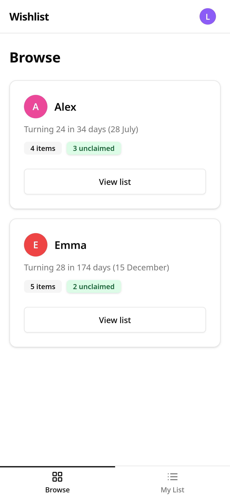
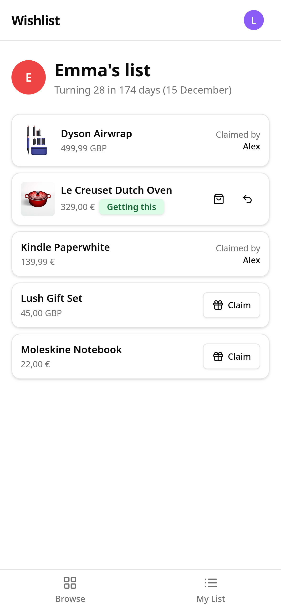
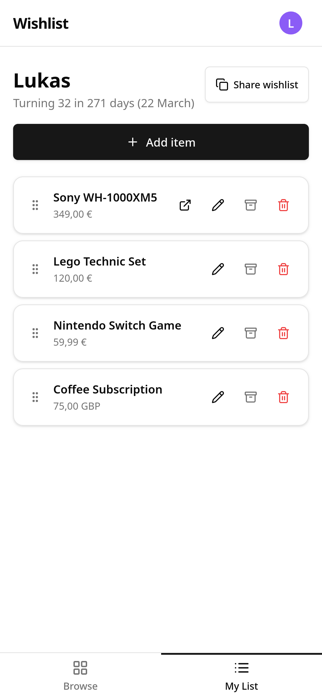

<div align="center">
  

  # Wishlist

  Wishlist is a simple self-hosted app for sharing gift ideas. Create a list, share it with friends or family, and let people claim items secretly so the surprise is kept.
</div>

---

<div align="center">
  <table>
    <tr>
      <td align="center"><br/><sub>Browse</sub></td>
      <td align="center"><br/><sub>Someone's list</sub></td>
      <td align="center"><br/><sub>My list</sub></td>
    </tr>
  </table>
</div>

## Features

- **Secret gift claiming**: Others can claim items on your list. You cannot see who claimed them.
- **Public share links**: Share a read-only list with people who do not have an account.
- **Per-item currency**: Each item can use its own currency. Your profile currency is used by default.
- **Photo uploads**: Add a photo to any item.
- **Product URL import**: Paste a product URL to auto-fill the name, description, price, and image.
- **Drag to reorder**: Move items into the order you want.
- **Priority levels**: Mark items as Low, Medium, or High priority.
- **Birthday countdowns**: See how many days are left until each person's next birthday.
- **Archive**: Move old items away from your active list without deleting them.
- **Received tracking**: Mark gifts as received after they arrive.
- **Admin panel**: Create users, reset passwords, and generate one-time signup links.
- **Simple deployment**: Runs as a single binary with SQLite. Docker is supported.

## Self-hosting

The recommended way to run Wishlist is with Docker.

### 1. Copy the example environment file

```bash
cp .env.example .env
```

Then edit your credentials:

```env
PORT=3967
DATABASE_PATH=/data/wishlist.db
APP_ENV=production
ADMIN_USERNAME=admin
ADMIN_PASSWORD=replace-this-with-a-long-random-password
ADMIN_DISPLAY_NAME=admin
UPLOADS_PATH=/data/uploads
```

### 2. Start Wishlist

```bash
docker compose up -d
```

Open [http://localhost:3967](http://localhost:3967) and log in with your admin credentials.

To add users, go to the **Admin** page. You can create users directly or generate a signup link.

## Installing as an app

Wishlist works as a PWA and can be added to your home screen on both iOS and Android.

**iOS (Safari)**
1. Open Wishlist in Safari
2. Tap the Share button at the bottom of the screen
3. Scroll down and tap **Add to Home Screen**
4. Tap **Add**

**Android (Chrome)**
1. Open Wishlist in Chrome
2. Tap the three-dot menu in the top right
3. Tap **Add to Home screen**
4. Tap **Add**

## Upgrading

Wishlist runs database migrations automatically on startup.

To upgrade, pull the latest image and restart:

```bash
docker compose pull && docker compose up -d
```

Your data lives in the `./data` volume. It is not touched during upgrades.

## License

MIT - see [LICENSE](LICENSE).
